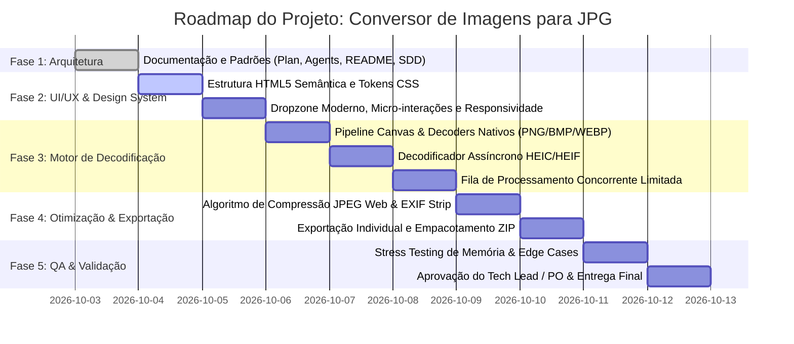

# Plano de Projeto (Plan.md)
## Zwei PixelCompact | Conversor de Imagens para JPG Compacto Web

---

## 1. Visão Geral e Contexto

O **Zwei PixelCompact** é uma aplicação corporativa e pessoal de alta performance, desenvolvida por **Zwei** para a **Zwei Coorporações LTDA**, focada em máxima velocidade, privacidade absoluta e facilidade de uso. Projetada para converter imagens em múltiplos formatos (`PNG`, `HEIC/HEIF` de smartphones Apple, `BMP`, `WEBP`, `TIFF`, etc.) em arquivos **JPG/JPEG ultra-otimizados e compactos para a web**.

Todo o processamento é executado **100% no dispositivo (Client-Side / Local)**, garantindo que nenhuma imagem seja enviada para servidores de terceiros ou nuvem, eliminando custos de infraestrutura e assegurando total sigilo aos usuários.

---

## 2. Estrutura de Liderança e Papéis

- **Tech Lead, Desenvolvedor Principal & Product Owner (PO):** **Zwei** (Direção técnica, validação de escopo, aprovação de releases e decisões de negócio).
- **Senior Software Engineer / Solutions Architect (Agent Antigravity):** Arquitetura técnica, pipeline de dados de imagem, ciclo de vida de memória, concorrência e conformidade client-side.
- **Senior Frontend Developer (Agent Antigravity):** Implementação semântica, Canvas API, File/Blob APIs, integração de decodificadores e empacotamento ZIP.
- **Senior UI/UX Designer (Agent Antigravity):** Design system corporativo moderno (dark mode glassmorphism com a identidade visual Zwei), micro-interações, acessibilidade e experiência fluida.
- **Senior QA & Security Engineer (Agent Antigravity):** Validação de integridade, testes de formatos de borda, resiliência de memória e prevenção de falhas.

---

## 3. Matriz de Escopo

### 3.1. O que VAMOS Fazer (No Escopo)
- [x] **Formatos de Entrada Suportados:**
  - `PNG` (Portable Network Graphics - com flattening de transparência sobre fundo branco configurável)
  - `HEIC / HEIF` (High Efficiency Image Container do ecossistema iOS/macOS)
  - `BMP` (Bitmap tradicional do Windows)
  - `WEBP` (Formato moderno WebP)
  - `TIFF / TIF` (Tagged Image File Format)
  - `JPG / JPEG` (Para recompressão e otimização para web)
- [x] **Formato de Saída Exclusivo:**
  - `JPG` compacto, otimizado para web com subamostragem cromática e qualidade ajustável (presets: Ultra Compact ~70%, Equilibrado ~82%, Alta Qualidade ~92%).
- [x] **Processamento 100% Client-Side:**
  - Nenhuma imagem trafega pela rede ou servidores.
- [x] **Processamento em Lote (Batch):**
  - Arrastar e soltar múltiplas imagens simultâneas.
  - Fila de conversão controlada para evitar consumo excessivo de memória.
- [x] **Exportação Flexível:**
  - Download individual de cada JPG gerado.
  - Download em lote agrupado em um único arquivo `.ZIP`.
- [x] **Feedback Visual & Métricas:**
  - Comparativo de tamanho antes vs. depois com percentual de economia (ex: `2.8 MB → 410 KB (-85%)`).
  - Pré-visualização lado a lado ou modal interativo.

### 3.2. O que NÃO VAMOS Fazer (Estritamente Fora de Escopo)
- [ ] **Conversão de Vídeos:** Proibida conversão ou suporte a arquivos de vídeo (`.mp4`, `.mov`, `.avi`, `.mkv`, etc.).
- [ ] **Conversão de GIFs Animados:** Não converter GIFs animados (para evitar perda de frames ou comportamento indefinido em JPG estático).
- [ ] **Extensões Inexistentes / Falsas:** Rejeição estrita a extensões forjadas ou não padronizadas. Validação por assinatura de arquivo (Magic Bytes / MIME).
- [ ] **Envio para Servidor / Cloud:** Sem backend em nuvem, sem bancos de dados, sem autenticação/login de usuários.
- [ ] **Edição Complexa de Fotos:** Sem ferramentas manuais de pintura, filtros artísticos instagramáveis ou distorção de imagem.
- [ ] **Conversão de Documentos:** Não converter PDFs, DOCX ou outros formatos textuais.

---

## 4. Fases de Execução e Roadmap Técnico

### Fase 1: Arquitetura, Governança e Documentação (Status: Concluída)
- Definição do escopo e exclusões.
- Criação dos arquivos mestres: `Plan.md`, `Agents.md`, `readme.md`, `sdd.md`.
- Alinhamento de governança com o Tech Lead & PO.

### Fase 2: Design System e Interface Web (UI/UX)
- Implementação de um layout moderno com tema escuro elegante (Dark Glassmorphism).
- Criação de uma Dropzone interativa com estados dinâmicos (dragover, drop, processing).
- Controles de configuração de saída:
  - Slider de qualidade (60% a 95%).
  - Presets rápidos: "Máxima Economia Web", "Equilibrado (Recomendado)", "Alta Fidelidade".
  - Opção de redimensionamento proporcional de largura máxima (ex: Original, 1920px Full HD, 1280px HD).
- Lista de arquivos em fila com indicador individual de status (Pendente, Convertendo, Concluído, Erro).

### Fase 3: Motor de Processamento & Decodificadores
- Módulo de validação de arquivos por extensão e MIME type com bloqueio imediato de vídeos e GIFs.
- Pipeline de decodificação:
  - Formatos nativos (PNG, BMP, WEBP) via `createImageBitmap` e Canvas 2D.
  - Suporte completo a HEIC/HEIF via integração de biblioteca Wasm (`heic2any`).
- Tratamento de transparência alfa (PNG/WEBP): composição automática sobre fundo branco padrão para evitar fundos pretos no JPG.
- Implementação de fila assíncrona (concorrência máxima de 2 conversões em paralelo para poupar memória do navegador).

### Fase 4: Otimização Web e Exportação
- Conversão para `image/jpeg` utilizando a API nativa de alta eficiência do Canvas.
- Remoção automática de metadados pesados desnecessários para a web (EXIF, miniaturas embutidas, perfis de cor desnecessários).
- Cálculo em tempo real de estatísticas de compressão:
  - Tamanho original vs. Tamanho final.
  - Porcentagem de redução de payload.
- Módulo de download individual com nome limpo (`nome-original.jpg`).
- Integração da biblioteca `JSZip` para download em lote com um único clique (`imagens-otimizadas-jpg.zip`).

### Fase 5: Garantia de Qualidade (QA), Testes e Validação
- Testes com imagens reais de iPhone (.HEIC).
- Testes com imagens pesadas PNG (fotos de 20MB+) e BMPs sem compressão.
- Verificação de vazamento de memória (auditoria de `URL.revokeObjectURL()`).
- Teste de rejeição de arquivos não autorizados (vídeos `.mp4`, GIFs animados `.gif`, executáveis renomeados).
- Revisão e homologação final pelo Tech Lead & PO.

### Fase 6: Expansão Desktop & Executável Autônomo (.exe) (Status: Concluída)
- Implementação do backend desktop via `pywebview` e Microsoft WebView2 (`desktop_app.py`).
- Integração bidirecional com a API do Windows Explorer (`select_folder()` e gravação direta no disco rígido sem passar por ZIP).
- Detecção dinâmica no frontend para exibir botão "Salvar na Pasta do PC".
- Geração e integração do ícone oficial `z-icon.ico` e logo `Z-logo.png`.
- Compilação do executável autônomo `dist/ZweiPixelCompact.exe` via PyInstaller com flag `--noconsole` e suporte standalone.

### Fase 7: Controle de Início Manual & Recompressão em Tempo Real (Status: Concluída)
- Chave seletora "Auto Iniciar" (`#autoConvertToggle`) para permitir adicionar imagens e ajustar parâmetros antes do início.
- Botão "Iniciar Conversão" em lote (`#startBatchBtn`) e play individual nos cards (`btn-single-start`).
- Botão de recompressão em tempo real no header (`#reprocessHeaderBtn`) e na barra de lote (`#reprocessBatchBtn`) com animação neon pulsante (`.pulse`) ao alterar configurações com fotos já carregadas.
- Botão de recompressão individual (`btn-single-reprocess`) em cada card para testes pontuais de fidelidade visual.
- Ciclo de reprocessamento seguro a partir de `item.file` original em memória com revogação limpa de ObjectURLs anteriores para evitar vazamentos de RAM.

---

## 5. Critérios de Aceitação (Definition of Done - DoD)

1. **Compatibilidade de Formatos:** Converte com sucesso imagens PNG, HEIC, BMP, WEBP e TIFF para JPG.
2. **Rejeição Rígida:** Rejeita explicitamente vídeos, GIFs e formatos inválidos com mensagem informativa ao usuário.
3. **Privacidade:** Nenhuma requisição HTTP de upload de arquivos de imagem é disparada; 100% da conversão ocorre localmente.
4. **Resiliência de Memória:** O navegador não trava nem apresenta congelamento perceptível durante a conversão de lotes com até 20 imagens.
5. **Usabilidade & Estética:** Interface com nota máxima de acabamento visual, responsiva em desktop e mobile, com identidade visual da Zwei Coorporações LTDA.
6. **Suporte Desktop:** Disponibilização de executável `ZweiPixelCompact.exe` independente para Windows com recurso de salvamento direto em pastas locais.
7. **Controle de Início & Recompressão:** Capacidade de desativar o início automático para calibrar qualidade antecipadamente e recomprimir imagens existentes em lote ou individualmente com atualização instantânea de métricas.
8. **Entrega dos Arquivos:** Todos os arquivos de documentação (`Plan.md`, `Agents.md`, `readme.md`, `sdd.md`) sincronizados e em conformidade estrita.

---

*Desenvolvido por **Zwei** | © 2026 Zwei Coorporações LTDA. Todos os direitos reservados.*
