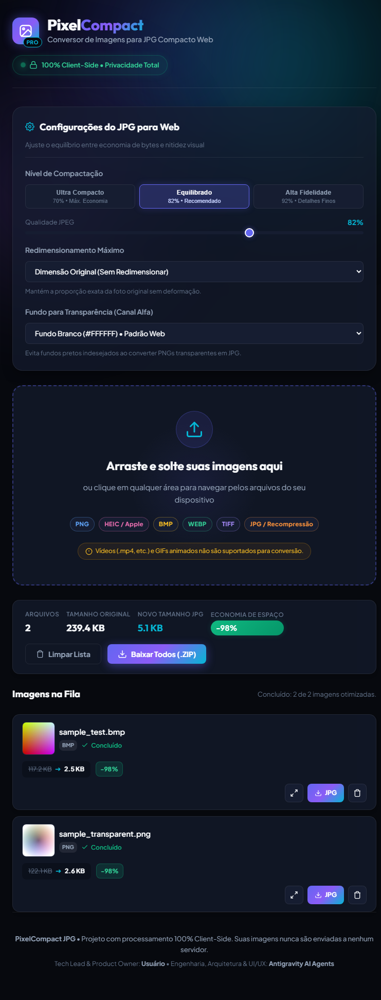

# 🖼️ Conversor de Imagens para JPG Compacto Web

> **Conversão de imagens de alta performance, 100% no navegador (Client-Side), com foco em máxima compactação para a web e privacidade absoluta.**

[](#segurança-e-privacidade)
[](#segurança-e-privacidade)
[](#matriz-de-compatibilidade)
[](#otimização-para-web)

---

## 📌 Visão Geral

O **Conversor de Imagens para JPG Compacto Web** é uma solução moderna e elegante criada para resolver um problema recorrente: a necessidade de converter fotos pesadas e formatos proprietários ou sem compressão (como fotos `.heic` tiradas com iPhone, gráficos `.png` pesados ou bitmaps `.bmp` do Windows) em imagens `.jpg` leves, compatíveis e perfeitamente otimizadas para publicação na internet, sites e redes sociais.

Diferente de conversores online convencionais que exigem o upload de seus arquivos para servidores desconhecidos, este conversor processa **tudo localmente no seu próprio navegador**. Suas imagens nunca saem do seu computador ou celular.

---

## 📸 Demonstração da Interface



<p align="center">
  <em>Processamento em lote com estatísticas globais, badge de economia de peso (-98%) e cards individuais.</em>
</p>

---

## ✨ Principais Funcionalidades

- **Privacidade Absoluta (Zero Server):** Processamento local utilizando as APIs de memória e renderização gráfica do navegador.
- **Suporte aos Principais Formatos:** Converte arquivos **PNG**, **HEIC/HEIF** (Apple), **BMP**, **WEBP**, **TIFF** e reprocessa **JPEGs** existentes.
- **Otimização Especializada para Web:**
  - Compressão JPEG com subamostragem cromática inteligente.
  - Eliminação de metadados desnecessários (dados EXIF, GPS e miniaturas embutidas que aumentam o peso do arquivo).
  - Remoção automática de canal alfa (transparência de PNGs mesclada perfeitamente sobre fundo branco limpo).
- **Processamento em Lote (Batch):** Arraste e solte dezenas de arquivos de uma única vez com fila inteligente que evita travamento de memória.
- **Feedback Visual com Métricas Reais:** Visualize instantaneamente o tamanho original, o novo tamanho e a porcentagem exata de economia (ex: `3.2 MB → 480 KB (-85%)`).
- **Exportação Ágil:**
  - Download individual de cada arquivo convertido com um clique.
  - Download em lote de todas as imagens empacotadas em um arquivo `.ZIP` através da biblioteca JSZip.
- **Design Moderno e Responsivo:** Interface com tema escuro sofisticado (*Dark Glassmorphism*), animações fluidas e suporte tanto para telas ultrawide quanto para dispositivos móveis.

---

## 🎯 Matriz de Compatibilidade

### ✅ Formatos de Entrada Suportados
| Formato | Extensões | Descrição / Tratamento |
| :--- | :--- | :--- |
| **PNG** | `.png` | Gráficos e capturas de tela. O canal de transparência é mesclado de forma suave em fundo branco. |
| **HEIC / HEIF** | `.heic`, `.heif` | Fotos de alta eficiência tiradas em iPhones/iPads. Decodificado via biblioteca WebAssembly. |
| **BMP** | `.bmp` | Imagens bitmap sem compressão comuns no ambiente Windows. |
| **WEBP** | `.webp` | Formato moderno do Google, convertido para compatibilidade universal em JPG. |
| **TIFF** | `.tiff`, `.tif` | Imagens brutas ou de digitalização fotográfica de alta fidelidade. |
| **JPG / JPEG** | `.jpg`, `.jpeg` | Recompressão de fotos existentes para reduzir o peso para a web. |

### 🚫 O que NÃO Entra no Escopo (Formatos Bloqueados)
| Item Bloqueado | Motivo da Exclusão |
| :--- | :--- |
| **Vídeos (`.mp4`, `.mov`, `.avi`, `.mkv`, etc.)** | O escopo do projeto é focado estritamente em imagens estáticas. Vídeos requerem pipelines pesados de transcoding de áudio/vídeo. |
| **GIFs Animados (`.gif`)** | A conversão de animações para JPG estático descartaria os quadros adicionais, resultando em perda da intenção do usuário. |
| **Extensões Falsas / Inexistentes** | Arquivos corrompidos ou com extensões inventadas são validados e bloqueados na camada de ingestão. |
| **Documentos (`.pdf`, `.docx`, etc.)** | Não é um conversor de documentos. |
| **Upload para a Nuvem / Servidores** | Para garantir custo zero e privacidade inabalável, não há nenhum backend remoto. |

---

## 🚀 Como Executar

A aplicação oferece duas formas de uso: como **software executável desktop (.exe)** ou diretamente no **navegador web**.

### 💻 Opção 1: Software Executável Desktop (Recomendado para PC)
Execute como um programa nativo do Windows com ícone próprio na barra de tarefas e botão exclusivo para **Salvar na Pasta do PC** (sem precisar descompactar ZIP):

1. Vá até a pasta `dist/` e execute o arquivo:
   ```text
   dist/PixelCompact.exe
   ```
2. *(Opcional)* Para recompilar o executável a qualquer momento:
   ```bash
   python build_exe.py
   ```

---

### 🌐 Opção 2: Abrir Diretamente no Navegador
1. Baixe ou clone o repositório em sua máquina.
2. Dê um duplo clique no arquivo `index.html` (ou abra pelo seu navegador favorito: Google Chrome, Microsoft Edge, Mozilla Firefox ou Safari).

### 🌐 Opção 3: Executar com um Servidor Local Simples
Para uma experiência ideal com recursos modernos (como Web Workers e Wasm):

```bash
# Usando Python (já disponível em quase todos os sistemas):
python -m http.server 8080

# Ou usando Node.js com npx:
npx serve .
```

Em seguida, acesse no navegador: `http://localhost:8080`.

---

## 🛠️ Tecnologias e Padrões Empregados

- **Estrutura & Semântica:** HTML5 moderno com tags semânticas e acessibilidade WCAG.
- **Estilização & Design:** Vanilla CSS com variáveis de design tokens, *Dark Glassmorphism*, Flexbox/Grid e animações CSS otimizadas pela GPU.
- **Lógica e Motor Gráfico:** JavaScript ES6+ modular com as APIs nativas:
  - `HTMLCanvasElement` & `CanvasRenderingContext2D` (para reamostragem gráfica e encode JPEG).
  - `createImageBitmap` / `FileReader` / `Blob API`.
  - `URL.createObjectURL` & `URL.revokeObjectURL` (gerenciamento ativo do ciclo de vida da memória).
- **Bibliotecas Client-Side Auxiliares:**
  - `heic2any`: Decodificação local de arquivos Apple HEIC/HEIF baseada em libheif Wasm.
  - `JSZip`: Agrupamento e compressão dos arquivos convertidos em formato `.ZIP` diretamente na memória do navegador.

---

## 🔒 Segurança e Privacidade

1. **Privacidade Garantida por Design:** Todas as operações ocorrem na memória RAM temporária da sua aba do navegador. Nenhuma imagem é gravada em discos de servidores ou enviada para APIs externas.
2. **Higienização de Nomes de Arquivos:** Nomes de arquivos são sanitizados contra caracteres especiais e sequências maliciosas (`../`) ao gerar os downloads individuais ou arquivos ZIP.
3. **Prevenção de Esgotamento de Memória:** O sistema emprega uma fila assíncrona controlada, garantindo que mesmo ao selecionar dezenas de fotos de alta resolução (como fotos de 48 megapixels), a aba do navegador não sofra travamento ou erro de Out of Memory (OOM).

---

## 👥 Equipe do Projeto

- **Tech Lead & Product Owner (PO):** Usuário
- **Senior Software Engineer:** Antigravity AI Agent
- **Senior Frontend Developer:** Antigravity AI Agent
- **Senior UI/UX Designer:** Antigravity AI Agent
- **Senior QA & Security Engineer:** Antigravity AI Agent

---

## 📄 Documentação Complementar

- [Plan.md](file:///c:/Users/Micro/Documents/Projeto_converterIMG_to_JPG/Plan.md) - Cronograma detalhado, fases e critérios de aceitação.
- [Agents.md](file:///c:/Users/Micro/Documents/Projeto_converterIMG_to_JPG/Agents.md) - Organograma da equipe e limites de atuação dos especialistas.
- [SDD.md](file:///c:/Users/Micro/Documents/Projeto_converterIMG_to_JPG/sdd.md) - Especificação Técnica e Design de Sistema Detalhado.
