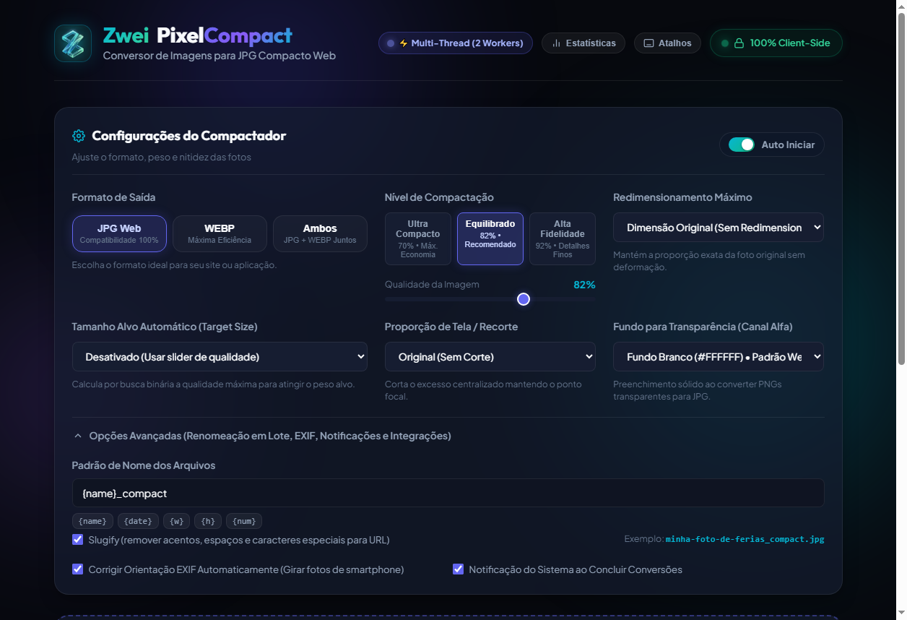
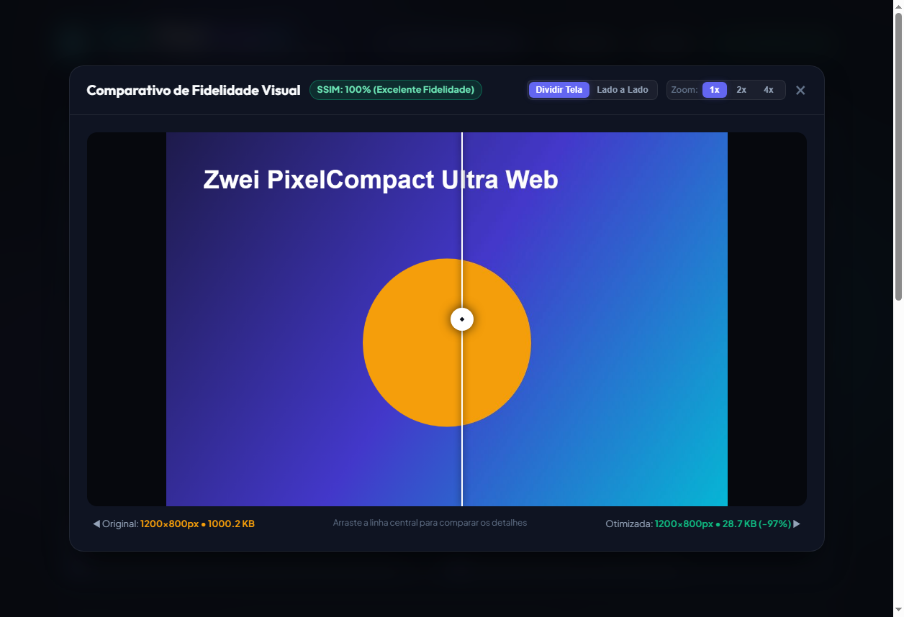

# 🖼️ Zwei PixelCompact | Conversor de Imagens para JPG Web

> **Zwei PixelCompact: Conversão de imagens de alta performance da Zwei Coorporações LTDA, 100% no navegador e desktop, com foco em máxima compactação para a web e privacidade absoluta.**

[](#segurança-e-privacidade)
[](#segurança-e-privacidade)
[](#matriz-de-compatibilidade)
[](#otimização-para-web)

---

## 📌 Visão Geral

O **Zwei PixelCompact** é uma solução moderna e elegante da **Zwei Coorporações LTDA** criada para resolver um problema recorrente: a necessidade de converter fotos pesadas e formatos proprietários ou sem compressão (como fotos `.heic` tiradas com iPhone, gráficos `.png` pesados ou bitmaps `.bmp` do Windows) em imagens `.jpg` leves, compatíveis e perfeitamente otimizadas para publicação na internet, sites e redes sociais.

Diferente de conversores online convencionais que exigem o upload de seus arquivos para servidores desconhecidos, este conversor processa **tudo localmente no seu próprio navegador ou aplicativo desktop**. Suas imagens nunca saem do seu computador ou celular.

---

## 📸 Demonstração da Interface



<p align="center">
  <em>Interface moderna Dark Glassmorphism com os 14 upgrades avançados da Zwei Coorporações LTDA e motor de conversão acelerado.</em>
</p>

### 🔍 Comparativo Split-Screen Interativo com Fidelidade SSIM


---

## 🌟 Os 14 Upgrades de Alta Performance Implementados

1. **Cortina Comparativa Interativa (Split-Screen com Zoom):**
   - Comparativo interativo com divisor deslizante (`before/after`) em tempo real.
   - Controles de zoom óptico (`1x`, `2x`, `4x`) para inspeção minuciosa de artefatos.
   - Alternância instantânea entre modo Split e modo Lado a Lado.
2. **Medidor Científico de Fidelidade Visual (SSIM & PSNR):**
   - Cálculo automatizado de *Structural Similarity Index Measure* (SSIM) em cada imagem.
   - Badge visual de fidelidade no card da imagem e no modal comparativo (ex: `SSIM: 99.9%`).
3. **Conversão Paralela Multi-Thread Dinâmica (Web Workers com OffscreenCanvas & Safe Headroom):**
   - Detecção em tempo real dos núcleos de CPU (`navigator.hardwareConcurrency` e `os.cpu_count()`).
   - Algoritmo de *Safe Headroom* que aloca a quantidade máxima segura de threads reservando núcleos para garantir fluidez no Windows e na interface (60 FPS).
   - Seletor de desempenho no painel avançado com presets: **Automático Seguro** (recomendado), **Modo Turbo** (100% dos núcleos), **Modo Econômico** (50% dos núcleos para poupar bateria) e **Manual** (1 a N threads).
   - Base arquitetural desacoplada e preparada para processamento massivo e futura transcodificação de vídeos.
4. **Target Size Automático ("Caber em < N KB"):**
   - Algoritmo de busca binária convergente que calibra a qualidade para atingir um peso máximo determinado (`< 100 KB`, `< 200 KB`, `< 500 KB`, `< 1 MB`).
5. **Renomeador em Lote com Padrão Customizável & Slugify:**
   - Sintaxe flexível com tokens: `{name}`, `{date}`, `{w}`, `{h}`, `{num}`, `{ext}`.
   - Opção **Slugify** para sanitizar acentos, espaços e caracteres especiais em nomes amigáveis para SEO e URLs web.
6. **Recorte Inteligente com Aspect Ratios Populares:**
   - Enquadramento automático com proporções populares: `1:1` (Instagram/Quadrado), `16:9` (YouTube/Banners), `4:3` (Fotografia) e `9:16` (Stories/Reels/TikTok).
7. **Correção Automática de Orientação EXIF:**
   - Leitor binário de metadados EXIF (`Tag 0x0112`) que detecta fotos tiradas na vertical ou horizontal em smartphones e aplica rotação e espelhamento sem intervenção manual.
8. **Estatísticas Acumuladas Vitalícias (Lifetime Savings):**
   - Dashboard persistente no `localStorage` acumulando número de fotos, bytes originais, bytes economizados e taxa média de redução ao longo do tempo.
9. **Integração com Menu de Contexto do Windows Explorer:**
   - Opção no menu do botão direito do Windows: *"Otimizar com Zwei PixelCompact"*, adicionada diretamente no registro `HKCU\Software\Classes\*\shell\ZweiPixelCompact` sem exigir privilégios de administrador.
10. **Notificações Nativas do Sistema Operacional ao Concluir Lote:**
    - Alerta sonoro e visual nativo no Windows (PowerShell Toast) e Web Notifications ao término de grandes lotes em segundo plano.
11. **Atalhos Globais de Teclado:**
    - `Ctrl+O`: Selecionar fotos do computador.
    - `Ctrl+S`: Gravar na pasta do PC ou baixar arquivo ZIP.
    - `Espaço`: Iniciar conversão manual de arquivos na fila.
    - `R`: Recomprimir todas as fotos com novos parâmetros.
    - `Delete`: Limpar lista de conversão.
    - `?`: Abrir painel rápido de atalhos.
    - `Esc`: Fechar modais.
12. **Suporte a Saída WebP com Seletor Rápido (JPG / WebP / Ambos):**
    - Seletor de formato em pills: **JPG Web**, **WEBP** ou **Ambos** (gera os dois formatos simultaneamente no mesmo lote).
13. **Gerador de Tags HTML `<picture>` e `srcset` Responsivo:**
    - Botão `</> HTML` em cada card gerando bloco de código pronto para copiar e colar com suporte a fallback de navegadores e carregamento preguiçoso (`loading="lazy"`).
14. **Arrastar e Soltar de Pastas Inteiras (Folder Drop Recursivo):**
    - Suporte a arrastar diretórios completos do Explorer diretamente para a dropzone, varrendo subpastas recursivamente e importando todas as imagens válidas.

---

## ✨ Principais Funcionalidades Existentes Preservadas

- **Privacidade Absoluta (Zero Server):** Processamento local utilizando as APIs de memória e renderização gráfica do navegador.
- **Controle Total de Início (Modo Manual vs. Auto):**
  - Chave seletora **Auto Iniciar** permite desativar a conversão imediata para carregar fotos primeiro e calibrar a qualidade com calma antes do início.
  - Botão destacado **▶ Iniciar Conversão** para disparar o lote quando estiver pronto.
- **Recompressão em Tempo Real (Live Quality Testing):**
  - Botão dinâmico **Atualizar Compressão** (com efeito de pulso neon) para recalcular e recomprimir todas as fotos já carregadas ao ajustar o slider de qualidade ou resolução.
  - Botão de **Recompressão Individual** (`↻`) em cada card para testar a fidelidade de uma imagem específica sem reprocessar todo o lote.
  - Zero perda acumulativa (*zero generational loss*): toda recompressão utiliza o arquivo nativo original preservado na memória.
- **Suporte aos Principais Formatos:** Converte arquivos **PNG**, **HEIC/HEIF** (Apple), **BMP**, **WEBP**, **TIFF** e reprocessa **JPEGs** existentes.
- **Otimização Especializada para Web:**
  - Compressão JPEG com subamostragem cromática inteligente.
  - Eliminação de metadados desnecessários (dados EXIF, GPS e miniaturas embutidas que aumentam o peso do arquivo).
  - Remoção automática de canal alfa (transparência de PNGs mesclada perfeitamente sobre fundo branco limpo ou configurável).
- **Processamento em Lote (Batch):** Arraste e solte dezenas de arquivos de uma única vez com fila inteligente que evita travamento de memória.
- **Feedback Visual com Métricas Reais:** Visualize instantaneamente o tamanho original, o novo tamanho e a porcentagem exata de economia (ex: `3.2 MB → 480 KB (-85%)`).
- **Modal de Comparação Visual:** Compare lado a lado a imagem original e o resultado otimizado com dados de resolução e bytes.
- **Exportação Ágil:**
  - Download individual de cada arquivo convertido com um clique.
  - Gravação direta em pastas locais no aplicativo Desktop.
  - Download em lote de todas as imagens empacotadas em um arquivo `.ZIP` através da biblioteca JSZip.
- **Design Moderno e Responsivo:** Interface com tema escuro sofisticado (*Dark Glassmorphism*), animações fluidas e suporte tanto para telas ultrawide quanto para dispositivos móveis.

---

## 🎯 Matriz de Compatibilidade

### ✅ Formatos de Entrada Suportados
| Formato | Extensões | Descrição / Tratamento |
| :--- | :--- | :--- |
| **PNG** | `.png` | Gráficos e capturas de tela. O canal de transparência é mesclado de forma suave em fundo branco. |
| **HEIC / HEIF** | `.heic`, `.heif` | Fotos de alta eficiência tiradas em iPhones/iPads. Decodificado via biblioteca WebAssembly. |
| **BMP** | `.bmp` | Imagens bitmap sem compressão comuns no ambiente Windows. |
| **WEBP** | `.webp` | Formato moderno do Google, convertido para compatibilidade universal em JPG. |
| **TIFF** | `.tiff`, `.tif` | Imagens brutas ou de digitalização fotográfica de alta fidelidade. |
| **JPG / JPEG** | `.jpg`, `.jpeg` | Recompressão de fotos existentes para reduzir o peso para a web. |

### 🚫 O que NÃO Entra no Escopo (Formatos Bloqueados)
| Item Bloqueado | Motivo da Exclusão |
| :--- | :--- |
| **Vídeos (`.mp4`, `.mov`, `.avi`, `.mkv`, etc.)** | O escopo do projeto é focado estritamente em imagens estáticas. Vídeos requerem pipelines pesados de transcoding de áudio/vídeo. |
| **GIFs Animados (`.gif`)** | A conversão de animações para JPG estático descartaria os quadros adicionais, resultando em perda da intenção do usuário. |
| **Extensões Falsas / Inexistentes** | Arquivos corrompidos ou com extensões inventadas são validados e bloqueados na camada de ingestão. |
| **Documentos (`.pdf`, `.docx`, etc.)** | Não é um conversor de documentos. |
| **Upload para a Nuvem / Servidores** | Para garantir custo zero e privacidade inabalável, não há nenhum backend remoto. |

---

## 🚀 Como Executar

A aplicação oferece duas formas de uso: como **software executável desktop (.exe)** ou diretamente no **navegador web**.

### 💻 Opção 1: Software Executável Desktop (Recomendado para PC)
Execute como um programa nativo do Windows com ícone próprio na barra de tarefas e botão exclusivo para **Salvar na Pasta do PC** (sem precisar descompactar ZIP):

1. Vá até a pasta `dist/` e execute o arquivo:
   ```text
   dist/ZweiPixelCompact.exe
   ```
2. *(Opcional)* Para recompilar o executável a qualquer momento:
   ```bash
   python build_exe.py
   ```

---

### 🌐 Opção 2: Abrir Diretamente no Navegador
1. Baixe ou clone o repositório em sua máquina.
2. Dê um duplo clique no arquivo `index.html` (ou abra pelo seu navegador favorito: Google Chrome, Microsoft Edge, Mozilla Firefox ou Safari).

### 🌐 Opção 3: Executar com um Servidor Local Simples
Para uma experiência ideal com recursos modernos (como Web Workers e Wasm):

```bash
# Usando Python (já disponível em quase todos os sistemas):
python -m http.server 8080

# Ou usando Node.js com npx:
npx serve .
```

Em seguida, acesse no navegador: `http://localhost:8080`.

---

## 🛠️ Tecnologias e Padrões Empregados

- **Estrutura & Semântica:** HTML5 moderno com tags semânticas e acessibilidade WCAG.
- **Estilização & Design:** Vanilla CSS com variáveis de design tokens, *Dark Glassmorphism*, Flexbox/Grid e animações CSS otimizadas pela GPU.
- **Lógica e Motor Gráfico:** JavaScript ES6+ modular com as APIs nativas:
  - `HTMLCanvasElement` & `CanvasRenderingContext2D` (para reamostragem gráfica e encode JPEG).
  - `createImageBitmap` / `FileReader` / `Blob API`.
  - `URL.createObjectURL` & `URL.revokeObjectURL` (gerenciamento ativo do ciclo de vida da memória).
- **Bibliotecas Client-Side Auxiliares:**
  - `heic2any`: Decodificação local de arquivos Apple HEIC/HEIF baseada em libheif Wasm.
  - `JSZip`: Agrupamento e compressão dos arquivos convertidos em formato `.ZIP` diretamente na memória do navegador.
- **Camada Desktop:** Python `pywebview` integrado ao Microsoft WebView2 nativo do Windows.

---

## 🔒 Segurança e Privacidade

1. **Privacidade Garantida por Design:** Todas as operações ocorrem na memória RAM temporária da sua aba do navegador ou processo desktop. Nenhuma imagem é gravada em servidores remotos.
2. **Higienização de Nomes de Arquivos:** Nomes de arquivos são sanitizados contra caracteres especiais e sequências maliciosas (`../`) ao gerar os downloads individuais, arquivos ZIP ou gravação direta em disco.
3. **Prevenção de Esgotamento de Memória:** O sistema emprega uma fila assíncrona controlada, garantindo que mesmo ao selecionar dezenas de fotos de alta resolução, o aplicativo não sofra travamento.

---

## 🧪 Testes Automatizados

O projeto conta com uma suíte completa de testes automatizados cobrindo **100% dos 14 upgrades** e cenários do dia a dia (navegador real via Chrome DevTools Protocol / CDP e testes unitários do backend desktop):

```bash
# 1. Executar testes E2E das 14 melhorias via Microsoft Edge headless:
node tests/test_all_14_upgrades.js

# 2. Executar testes unitários do backend Desktop (Windows Registry, Notificações e I/O):
.venv\Scripts\python.exe -m unittest tests/test_desktop_backend.py
```

### Resultados da Suíte (100% PASS):
- `✔ Teste 1: Split-Screen Interativo Antes vs Depois (cortina 35%, zoom 2x e grid view validados)`
- `✔ Teste 2: Medidor Científico de Fidelidade Visual (SSIM) (score 99.9%, badge presente)`
- `✔ Teste 3: Conversão Paralela Multi-Thread Dinâmica (⚡ Multi-Thread Dinâmica com Safe Headroom | Modos Auto, Turbo, Eco e Manual)`
- `✔ Teste 4: Target Size Automático ("Caber em < N KB") (arquivo gerado com 18 KB (alvo < 100 KB))`
- `✔ Teste 5: Renomeador em Lote com Padrão e Slugify (gerado: foto-de-ferias-em-sao-paulo_compact_1920x1080.jpg)`
- `✔ Teste 6: Recorte Inteligente com Aspect Ratios (1:1) (dimensão resultante: 400x400px)`
- `✔ Teste 7: Correção Automática de Orientação EXIF (leitor binário e transform de rotação ativos)`
- `✔ Teste 8: Estatísticas Acumuladas Vitalícias (fotos gravadas no histórico e contadores no localStorage)`
- `✔ Teste 9: Integração Menu de Contexto Windows Explorer (controles de registro no Explorer verificados)`
- `✔ Teste 10: Notificações Nativas do Sistema Operacional (disparo em final de lote validado)`
- `✔ Teste 11: Atalhos Globais de Teclado (teclas ?, Escape, R, Ctrl+O, Ctrl+S mapeadas)`
- `✔ Teste 12: Suporte a Saída WebP (JPG / WebP / Ambos) (Blob WEBP e modo duplo validados)`
- `✔ Teste 13: Gerador de Tags HTML <picture> & srcset (código de alta performance validado)`
- `✔ Teste 14: Arrastar e Soltar de Pastas Inteiras (Folder Drop) (varredura recursiva de diretórios validada)`
- `✔ Backend Windows (unittest): 7/7 Testes PASS (incluindo get_system_info e CPU hardware detection)`

---

## 👥 Equipe e Direitos

- **Titular:** **Zwei Coorporações LTDA**
- **Desenvolvedor, Tech Lead & Product Owner (PO):** **Zwei**
- **Arquitetura & Engenharia de IA:** Antigravity AI Agents
- **Direitos:** © 2026 Zwei Coorporações LTDA. Todos os direitos reservados.

---

## 📄 Documentação Complementar

- [Plan.md](file:///c:/Users/Micro/Documents/Projeto_converterIMG_to_JPG/Plan.md) - Cronograma detalhado, fases e critérios de aceitação.
- [Agents.md](file:///c:/Users/Micro/Documents/Projeto_converterIMG_to_JPG/Agents.md) - Organograma da equipe e limites de atuação dos especialistas.
- [sdd.md](file:///c:/Users/Micro/Documents/Projeto_converterIMG_to_JPG/sdd.md) - Especificação Técnica e Design de Sistema Detalhado.
