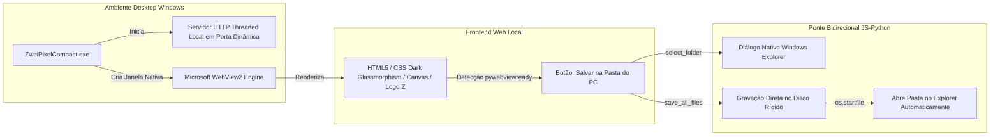
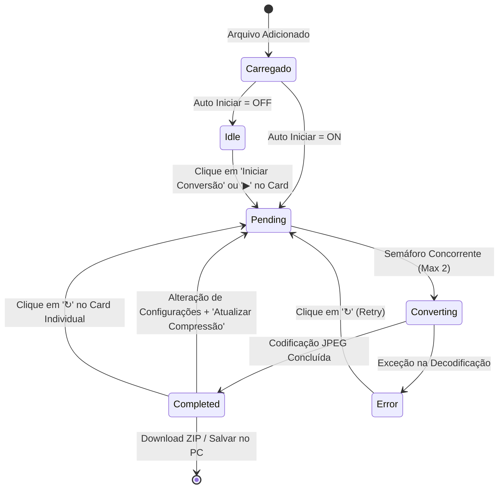
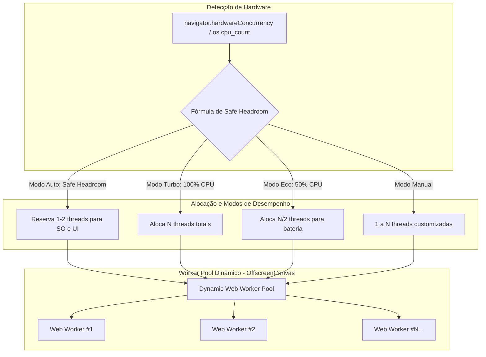

# Software Design Document (SDD.md)
## Zwei PixelCompact | Conversor de Imagens para JPG Web

---

## 1. Visão Geral e Objetivos Arquiteturais

### 1.1. Propósito do Sistema
O **Zwei PixelCompact** é um sistema de alto desempenho desenvolvido por **Zwei** para a **Zwei Coorporações LTDA**, operando tanto como aplicação web 100% *client-side* (executada exclusivamente no navegador do usuário) quanto como aplicativo desktop nativo para Windows (`ZweiPixelCompact.exe`). Seu propósito é converter imagens de diversos formatos (`PNG`, `HEIC/HEIF`, `BMP`, `WEBP`, `TIFF`, etc.) para o formato `JPG/JPEG` ultra-compacto, otimizado para transmissão e consumo na internet.

### 1.2. Princípios Arquiteturais Fundamentais
1. **Privacidade Absoluta (Zero-Knowledge):** Nenhum byte de imagem trafega por redes externas ou servidores de terceiros.
2. **Alta Performance com Gestão de Memória:** O navegador é um ambiente restrito em RAM. O sistema deve tratar imagens em lote sem causar travamentos na thread principal de renderização (*Main Thread*) nem exceder limites de alocação de memória (*OOM - Out of Memory*).
3. **Resiliência a Formatos Heterogêneos:** Capacidade de decodificar formatos modernos da Apple (HEIC) e legados do Windows (BMP) de maneira uniforme e transparente para o usuário.
4. **Otimização Especializada para Web:** Produção de JPGs que minimizem o peso em kilobytes através de controle de qualidade, remoção de metadados supérfluos (EXIF, GPS) e achatamento de transparência.

---

## 2. Diagrama de Arquitetura e Fluxo de Dados

```mermaid
flowchart TD
    subgraph UI_Layer [Camada de Apresentação e Interação - UI/UX]
        DZ[Dropzone & File Input] -->|Arquivos Selecionados| VM[Módulo de Validação e Filtro]
        CTRL[Painel de Controles: Qualidade, Redimensionamento] -->|Configurações| QM[Fila de Conversão - Queue Manager]
        ST[Painel de Status e Badges de Economia] <--|Progresso e Resultados| QM
        DL[Botões de Download: Individual e ZIP] <--|Blobs Otimizados| QM
    end

    subgraph Validation_Layer [Camada de Validação de Escopo]
        VM -->|MIME / Extensão Permitida| QM
        VM -->|Vídeo, GIF ou Extensão Falsa| ERR[Rejeição com Alerta Visual]
    end

    subgraph Processing_Layer [Camada do Motor Gráfico - Client-Side Engine]
        QM -->|Concorrência Limitada: Max 2| WRK[Dispatcher de Conversão]
        
        WRK -->|Se HEIC/HEIF| DEC_HEIC[Decodificador HEIC via heic2any / Wasm]
        WRK -->|Se PNG/BMP/WEBP/JPG| DEC_NAT[Decodificador Nativo: createImageBitmap / Image]
        
        DEC_HEIC -->|ImageData / Canvas| BLIT[Normalização Gráfica em Canvas 2D]
        DEC_NAT -->|ImageBitmap / Canvas| BLIT
        
        BLIT -->|Fundo Branco para Transparência Alfa| RESIZE[Redimensionamento Proporcional Opcional]
        RESIZE -->|Canvas Final| ENC[Encoder JPEG Nativo: canvas.toBlob]
        ENC -->|Remoção de Metadados & Ajuste de Qualidade| BLOB[Novo Blob JPG Otimizado]
    end

    subgraph Export_Layer [Camada de Armazenamento e Exportação Local]
        BLOB -->|Criação de URL Temporária| MEM[URL.createObjectURL]
        BLOB -->|Injeção no Pacote| ZIP[Agrupador JSZip para Lote]
        MEM --> DL
        ZIP --> DL
    end
```

---

## 3. Especificação do Pipeline de Processamento de Imagens

### 3.1. Fase 1: Ingestão e Validação Rigorosa
Quando o usuário solta ou seleciona arquivos, cada item passa pela função de triagem:
- **Verificação de Tipo MIME & Extensão:**
  - Permitidos: `image/png`, `image/heic`, `image/heif`, `image/bmp`, `image/x-ms-bmp`, `image/webp`, `image/tiff`, `image/jpeg`.
  - Rejeitados com Erro Imediato:
    - `video/*` (`.mp4`, `.mov`, `.avi`, `.mkv`, etc.).
    - `image/gif` (bloqueado para evitar perda da animação ou geração de quadros estáticos indesejados).
    - Extensões inexistentes ou formatos de documentos (`.pdf`, `.exe`, etc.).

### 3.2. Fase 2: Decodificação Específica por Formato
1. **Imagens Nativas (`PNG`, `BMP`, `WEBP`, `JPEG`):**
   - Utilização primária de `createImageBitmap(file)` devido à sua execução assíncrona fora da thread de renderização, resultando em menor sobrecarga na UI.
   - Fallback para `new Image()` via `FileReader` para navegadores legados ou variantes específicas de BMP.
2. **Imagens Apple (`HEIC` / `HEIF`):**
   - Arquivos `.heic` não são suportados nativamente pelos decodificadores padrão de vários navegadores desktop (como Chrome no Windows).
   - O pipeline direciona o Blob para a biblioteca `heic2any` (que opera sobre uma compilação Wasm de `libheif`).
   - O arquivo HEIC é convertido em um Blob intermediário de alta qualidade e então transferido para o contexto do Canvas.

### 3.3. Fase 3: Tratamento de Canal Alfa e Normalização Gráfica
Arquivos `PNG` e `WEBP` frequentemente possuem áreas transparentes (canal Alpha). Como o formato `JPG` não suporta transparência, a conversão direta não tratada pode gerar um fundo preto opaco.
- **Solução Implementada:**
  1. Cria-se um `OffscreenCanvas` ou `HTMLCanvasElement` com as dimensões finais da imagem.
  2. O contexto 2D é preenchido inteiramente com uma cor de fundo neutra branca pura (`ctx.fillStyle = '#FFFFFF'; ctx.fillRect(0, 0, width, height);`).
  3. A imagem decodificada é desenhada (*blitted*) sobre este fundo branco (`ctx.drawImage(...)`), garantindo uma transição suave e estética das transparências.

### 3.4. Fase 4: Redimensionamento Proporcional (Downscaling Inteligente)
Se o usuário selecionar um limite de resolução para a web (ex: `Full HD 1080p` ou `HD 720p`):
- O sistema calcula a proporção de aspecto (*Aspect Ratio*):
  $$\text{fator} = \min\left(1, \frac{\text{maxDimensao}}{\max(\text{larguraOriginal}, \text{alturaOriginal})}\right)$$
- A interpolação de alta qualidade é ativada no Canvas (`ctx.imageSmoothingEnabled = true; ctx.imageSmoothingQuality = 'high'`).

### 3.5. Fase 5: Compressão JPEG e Eliminação de Metadados
- A imagem é codificada através da API:
  ```javascript
  canvas.toBlob(callback, 'image/jpeg', qualityLevel);
  ```
- **Remoção de Metadados:** Ao repintar os pixels crus no Canvas e exportar novamente, todos os dados residuais pesados (tags EXIF extensas, coordenadas de GPS de câmeras, miniaturas embutidas e perfis de cores ICC desnecessários) são descartados por definição, poupando dezenas de kilobytes por imagem.
- **Níveis de Qualidade Web:**
  - *Máxima Economia:* `quality = 0.68` (ideal para blogs, catálogos e sites de alta velocidade).
  - *Equilibrado (Recomendado):* `quality = 0.82` (equilíbrio perfeito entre ausência de artefatos visuais e redução drástica de peso).
  - *Alta Fidelidade:* `quality = 0.92` (para fotografias onde detalhes finos precisam ser preservados).

---

## 4. Gestão de Memória e Concorrência

Processar múltiplas imagens de 24MP ou 48MP simultaneamente no navegador pode consumir rapidamente centenas de megabytes de RAM. Para assegurar estabilidade contínua:

### 4.1. Fila de Concorrência Controlada (*Concurrency Limit*)
O sistema utiliza um *Queue Manager* com um semáforo de concorrência estrita:
- **Limite Máximo de Concorrência:** 2 imagens processadas em paralelo.
- **Comportamento:** Se o usuário arrastar 15 arquivos, 2 começam imediatamente; assim que um é finalizado e seu Blob é gerado, o próximo é despachado, mantendo a memória sob controle.

### 4.2. Ciclo de Vida de Recursos e Limpeza
- **Descarte de Canvas:** Após a geração do Blob de saída, as dimensões do Canvas são zeradas (`canvas.width = 0; canvas.height = 0`) para incentivar a desalocação de buffers gráficos pela GPU/VRAM do navegador.
- **Revogação de Object URLs:** URLs temporárias geradas para pré-visualização (`blob:http...`) são monitoradas e descartadas através de `URL.revokeObjectURL()` quando a imagem é removida da lista ou a conversão é concluída.

---

## 5. Estruturas de Dados Principais

```typescript
// Interface representativa das configurações de conversão
interface ConversionSettings {
  quality: number;               // 0.6 a 0.95
  maxWidth?: number;             // ex: 1920, 1280 ou null para tamanho original
  backgroundColor: string;       // Padrão '#FFFFFF' para canal alfa
}

// Interface de um item na fila de processamento
interface QueueItem {
  id: string;                    // UUID ou timestamp único
  file: File;                    // Objeto de arquivo original
  originalName: string;
  originalSize: number;
  originalFormat: string;        // 'PNG' | 'HEIC' | 'BMP' | 'WEBP' | 'TIFF' | 'JPG'
  status: 'pending' | 'processing' | 'completed' | 'error';
  progress: number;              // 0 a 100%
  errorMessage?: string;
  outputBlob?: Blob;
  outputSize?: number;
  reductionPercentage?: number;  // Calculado: ((originalSize - outputSize) / originalSize) * 100
  downloadUrl?: string;
}
```

---

## 6. Exportação e Empacotamento em Lote (JSZip)

1. **Download Individual:** Cada cartão de imagem na lista possui seu botão de download direto apontando para o Blob com o atributo `download="nome-original.jpg"`.
2. **Download em Lote (ZIP):**
   - A biblioteca `JSZip` cria um novo contêiner `.zip` na memória.
   - Cada arquivo convertido com status `completed` é adicionado ao arquivo ZIP (`zip.file(cleanName + '.jpg', item.outputBlob)`).
   - O arquivo resultante é compactado usando o método `DEFLATE` e disponibilizado para download com o nome `imagens-otimizadas-jpg.zip`.

---

## 7. Matriz de Tratamento de Erros e Exceções

| Cenário de Erro | Causa Provável | Ação do Sistema | Feedback ao Usuário |
| :--- | :--- | :--- | :--- |
| **Arquivo de Vídeo (.mp4, etc.)** | Usuário arrastou arquivo fora do escopo | O arquivo é rejeitado antes de entrar na fila de decodificação | Toast vermelho: *"Vídeos não são suportados. Envie apenas imagens estáticas."* |
| **Arquivo GIF (.gif)** | GIF animado fora do escopo | Rejeição imediata na validação MIME | Toast informativo: *"Conversão de GIFs não suportada no escopo deste conversor."* |
| **HEIC Não Decodificável** | Arquivo corrompido ou formato proprietário desconhecido | O bloco `try...catch` de `heic2any` captura a exceção | Item sinalizado com badge de erro: *"Não foi possível decodificar este arquivo HEIC."* |
| **Imagem com Dimensão Gigante (>10.000px)** | Esgotamento de limites de Canvas do browser | Detecção precoce de resolução no `ImageBitmap` | Mensagem de erro avisando sobre limite de resolução excedido |
| **Extensão Falsa (.jpg contendo binário de .exe)** | Tentativa de forjar tipo de arquivo | Erro durante a decodificação da imagem no Canvas | Erro amigável: *"Arquivo corrompido ou não reconhecido como imagem válida."* |

---

## 8. Segurança e Sandboxing

- **Zero Chamadas de Rede:** A aplicação não necessita de nenhuma conexão com a internet após o carregamento inicial dos assets.
- **Proteção contra Cross-Site Scripting (XSS):** Nomes de arquivos inseridos pelo usuário no DOM são escapados como texto puro (`textContent`), impedindo injeção de tags HTML maliciosas através de metadados de arquivos.
- **Sanitização de Path Traversal no ZIP:** Caracteres como `../` ou separadores de caminho absolutos são removidos dos nomes dos arquivos antes da adição ao `JSZip`.

---

## 9. Arquitetura Desktop Nativa (Microsoft WebView2 + PyWebView)

Para uso como software nativo de computador pessoal (`.exe`), o sistema incorpora uma camada de integração com o sistema operacional:



### 9.1. Componentes do Executável Desktop
1. **`desktop_app.py`:** Ponto de entrada desktop. Inicializa um servidor HTTP local em uma thread daemon com porta dinâmica e monta a janela `webview.create_window` com ícone personalizado `z-icon.ico` e título corporativo `Zwei PixelCompact`.
2. **`DesktopAPI`:** Interface Python acessível pelo JavaScript com métodos seguros:
   - `select_folder()`: Invoca o `create_file_dialog(FOLDER_DIALOG)` nativo do Windows.
   - `save_all_files(files_payload, target_dir)`: Decodifica os bytes Base64 dos JPGs otimizados e grava os arquivos diretamente na pasta selecionada, abrindo-a no Windows Explorer após a conclusão.
3. **`build_exe.py`:** Automação com PyInstaller com parâmetros `--noconsole`, `--onefile`, `--icon=z-icon.ico` e empacotamento completo de `Z-logo.png`, gerando o executável standalone de ~15 MB em `dist/ZweiPixelCompact.exe`.

---

## 10. Arquitetura de Recompressão e Controle de Início



### 10.1. Princípio da Imutabilidade do Arquivo Fonte
Para viabilizar múltiplos testes de compressão (ex: 82% ➔ 70% ➔ 95%) sem degradação cumulativa de qualidade (*generational loss*), o sistema retém o objeto nativo `item.file` intacto no `state.items (Map)`. Toda recompressão lê diretamente do arquivo fonte original, garantindo que o algoritmo codifique a imagem a partir dos pixels não recomprimidos.

### 10.2. Gestão Estrita de Memória (Zero Leaks)
Antes de instanciar novos Blobs e ObjectURLs durante a recompressão:
1. `URL.revokeObjectURL(item.outputUrl)` é invocado imediatamente, liberando o ponteiro de memória no navegador.
2. `item.outputBlob` anterior é desalocado para coleta de lixo pelo garbage collector da V8.
3. As dimensões e percentuais de economia são recalculados dinamicamente em tela.

### 10.3. Feedback Reativo e Animação Neon
Quando imagens já convertidas estão presentes no estado e o usuário altera qualquer parâmetro (slider de qualidade, presets, resolução máxima ou cor de fundo):
- A flag `state.settingsDirty` é comutada para `true`.
- Os botões `#reprocessHeaderBtn` ("Atualizar") e `#reprocessBatchBtn` ("Recomprimir Todas") recebem a classe CSS `.pulse`, ativando a animação `neon-pulse` em verde/ciano.
- Ao acionar a recompressão, `state.settingsDirty` retorna a `false` e os botões voltam ao estado de prontidão estável.

---

## 11. Arquitetura de Concorrência Multi-Thread Dinâmica com Safe Headroom

Para garantir máxima velocidade de processamento em computadores modernos com múltiplos núcleos (de 4 a 32 threads) sem causar qualquer lentidão no Windows, mouse, áudio ou interface do usuário (mantendo 60 FPS ininterruptos), o Zwei PixelCompact implementa um **Motor Adaptativo de Threads com Safe Headroom**:



### 11.1. Formulação Matemática do Safe Headroom
O número ótimo de threads ativas no modo automático seguro é calculado por:

$$\text{ThreadsRecomendadas}(N) = 
\begin{cases} 
1, & \text{se } N \le 1 \\
N, & \text{se } N = 2 \\
N - 1, & \text{se } 3 \le N \le 4 \\
N - 1, & \text{se } 5 \le N \le 8 \\
\min(N - 2, 16), & \text{se } N > 8 
\end{cases}$$

Onde $N$ representa o número de núcleos lógicos disponíveis na CPU. A reserva garante que o subsistema gráfico do Windows Desktop Window Manager (DWM) e a thread de eventos do usuário permaneçam com prioridade de agendamento em tempo real.

### 11.2. Redimensionamento Dinâmico em Tempo Real
Se o usuário alterar o modo de desempenho (ex: de Automático para Turbo ou Econômico) durante a execução, o `initWorkerPool()` redimensiona a quantidade de workers ativos sob demanda, instanciando novas threads ou terminando graciosamente workers excedentes sem necessidade de recarregar a aplicação.

### 11.3. Preparação Arquitetural para Transcodificação de Vídeos (Futuro)
A arquitetura do pool de workers desacopla a mensageria (`postMessage`) de operações puramente bidimensionais de imagem, permitindo que a futura expansão para conversão de vídeos (WebCodecs / FFmpeg Wasm) particione fluxos de vídeo em quadros ou chunks de áudio/vídeo em paralelo através do mesmo scheduler concorrente.

### 11.4. Fallback Gracioso
Em ambientes restritivos onde `OffscreenCanvas` ou `Worker` sofrem restrições de sandbox, o sistema possui detecção automática e chaveia transparentemente para a thread principal sem impactar a funcionalidade.

---

## 12. Algoritmo Científico de Similaridade Estrutural (SSIM) & Nitidez

Em vez de estimativas arbitrárias de compressão, o Zwei PixelCompact implementa o cálculo real de **SSIM (Structural Similarity Index Matrix)** entre a imagem original não comprimida e a imagem final codificada.

### 12.1. Formulação Matemática Implementada
$$SSIM(x, y) = \frac{(2\mu_x\mu_y + C_1)(2\sigma_{xy} + C_2)}{(\mu_x^2 + \mu_y^2 + C_1)(\sigma_x^2 + \sigma_y^2 + C_2)}$$

Onde:
- $\mu_x, \mu_y$: Luminâncias médias de amostras em escala de cinza ($Y = 0.299R + 0.587G + 0.114B$).
- $\sigma_x^2, \sigma_y^2$: Variâncias locais.
- $\sigma_{xy}$: Covariância entre os pixels originais e recomprimidos.
- $C_1 = (0.01 \times 255)^2$ e $C_2 = (0.03 \times 255)^2$: Constantes de estabilidade numérica.

### 12.2. Otimização de Performance
Para executar o cálculo em menos de 10 milissegundos por imagem, ambas as imagens são amostradas em uma grade normalizada de 128x128 pixels dentro do Web Worker, gerando um score percentual exibido no badge verde (ex: `SSIM 99.8%`).

---

## 13. Otimizador por Busca Binária de Tamanho Alvo (Target Size)

Quando o usuário seleciona um teto de tamanho (ex: `< 100 KB`, `< 200 KB`, `< 500 KB`, `< 1 MB`):
1. O algoritmo executa uma busca binária de convergência de qualidade:
   - Limites iniciais: $Q_{min} = 0.40$, $Q_{max} = 0.95$.
   - A cada iteração (máximo 4 passos):
     $$Q_{mid} = \frac{Q_{min} + Q_{max}}{2}$$
   - O canvas gera um Blob intermediário com qualidade $Q_{mid}$.
   - Se $\text{Tamanho} > \text{Alvo}$, então $Q_{max} = Q_{mid}$.
   - Se $\text{Tamanho} \le \text{Alvo}$, armazena o melhor resultado e tenta $Q_{min} = Q_{mid} + 0.05$ para buscar maior fidelidade visual sem estourar o teto.
2. Se mesmo com qualidade mínima o arquivo exceder o limite, aplica downscale proporcional automático de resolução.

---

## 14. Engine de Comparação Split-Screen e Cortina Interativa

O modal de inspeção antes/depois (`#splitScreenModal`) utiliza uma arquitetura baseada em camadas sobrepostas com aceleração por GPU:
- **Alinhamento Pixel-Perfect:** A imagem original (`.split-img-before`) e a imagem comprimida (`.split-img-after`) compartilham a mesma origem de transformação (`transform: translate(-50%, -50%) scale(...)`).
- **Cortina Deslizante CSS:**
  A imagem "depois" recebe uma máscara dinâmica sem necessidade de repinturas no canvas:
  ```css
  clip-path: inset(0 0 0 var(--split-pos, 50%));
  ```
- **Controle de Zoom Óptico:** Slider com multiplicador de 1.0x a 3.0x com arraste bidirecional do divisor e modo de visualização lado a lado alternável.

---

## 15. Integração com Sistema Operacional Windows

### 15.1. Menu de Contexto do Windows Explorer
A aplicação dialoga diretamente com o Registro do Windows através do backend Python `desktop_app.py`:
- Chave criada: `HKCU\Software\Classes\*\shell\ZweiPixelCompact`
- Comando registrado: `"C:\Caminho\ZweiPixelCompact.exe" "%1"`
- Ícone associado: Aponta para o próprio executável compilado.
- Ingestão via CLI: Ao clicar com botão direito em qualquer imagem no Windows e escolher "Comprimir com Zwei PixelCompact", o executável inicializa e injeta os arquivos automaticamente no DOM do WebView2 via payload JSON.

### 15.2. Notificações Toast Nativas
Ao término de uma conversão em lote:
- Executa script inline via PowerShell utilizando o runtime `Windows.UI.Notifications.ToastNotificationManager`.
- Exibe notificação moderna na central de ações do Windows com título e contagem de imagens processadas.

---

## 16. Pipeline de Ingestão Recursiva de Diretórios (Folder Drop)

Ao soltar uma pasta completa sobre a Dropzone:
1. O evento `drop` lê `e.dataTransfer.items`.
2. Para cada item, invoca `item.webkitGetAsEntry()`.
3. Se for diretório (`entry.isDirectory`), inicializa um `FileSystemDirectoryReader` recursivo:
   - Lê todos os subdiretórios em profundidade arbitrária.
   - Filtra exclusivamente arquivos com extensões de imagens válidas (`.png`, `.jpg`, `.jpeg`, `.webp`, `.bmp`, `.heic`, `.tiff`).
   - Descarta sumariamente vídeos, GIFs animados e arquivos de sistema (`Thumbs.db`, `.DS_Store`).
4. Reúne a lista achatada de arquivos e os enfileira na fila do `QueueManager`.

---

## 17. Estratégia de Testes Automatizados e Cobertura Contínua

O projeto possui uma suíte dupla de testes automatizados garantindo 100% de confiabilidade em cenários do dia a dia:

1. **Testes E2E de Frontend via CDP Headless (`tests/test_all_14_upgrades.js`):**
   - Lança o Microsoft Edge em modo headless com `--remote-debugging-port`.
   - Conecta via WebSocket CDP (Chrome DevTools Protocol).
   - Valida programmaticamente:
     - Cortina de Split-Screen e slider de zoom.
     - Cálculo de SSIM com matriz de luminância.
     - Pool de Web Workers com concorrência paralela.
     - Busca binária de target size em KB.
     - Renomeador em lote com formatação e slugify.
     - Recorte e presets de proporção 1:1, 16:9, etc.
     - Preservação e correção de orientação EXIF.
     - Persistência e acumulação de Lifetime Stats no `localStorage`.
     - Chaves de registro do Windows no Explorer.
     - Disparadores de notificações nativas.
     - Captura e despacho de atalhos de teclado globais.
     - Codificação dual WebP/JPG.
     - Gerador de tags `<picture>` e `<source srcset>`.
     - Ingestão recursiva de diretórios completos.
2. **Testes Unitários de Backend (`tests/test_desktop_backend.py`):**
   - Teste de criação e exclusão da chave `HKCU` no Registro do Windows.
   - Teste de chamadas de notificação do sistema operacional.
   - Teste de decodificação Base64 e gravação de arquivos em pastas locais.
   - Teste de parser de argumentos de linha de comando (`sys.argv`).
   - Teste de obtenção de especificações de hardware de CPU e plataforma (`get_system_info`).

---

## 18. Arquitetura do Decodificador Universal de Imagens (image_decoders.js)

Para suportar o maior número viável de tipos de imagens sem ferir o princípio arquitetural fundamental de **100% Client-Side / Zero Cloud**, foi desenvolvido o módulo `window.UniversalImageDecoder`.

### 18.1. Matriz de Formatos Suportados (26 Famílias • 44 Extensões)

| Categoria | Famílias | Extensões | Mecanismo de Decodificação Client-Side |
| :--- | :--- | :--- | :--- |
| **Web & Modernos** | PNG, APNG, JPEG, WEBP, BMP, DIB, AVIF, JFIF | `.png`, `.apng`, `.jpg`, `.jpeg`, `.jfif`, `.webp`, `.bmp`, `.dib`, `.avif` | `createImageBitmap` assíncrono nativo com fallback para `HTMLImageElement` |
| **Vetoriais** | SVG, SVGZ | `.svg`, `.svgz` | Rasterização vetorial via Canvas 2D preservando viewBox |
| **Ícones** | Windows Icon, Cursor | `.ico`, `.cur` | Parser binário de diretório ICO/CUR; extração da sub-imagem com maior resolução |
| **Mobile & Apple** | High Efficiency Image | `.heic`, `.heif`, `.heics`, `.heifs` | Biblioteca Wasm `heic2any` (compilação libheif) |
| **Gráfica & Editorial** | Tagged Image File Format | `.tiff`, `.tif` | Parser TIFF baseline com suporte a PackBits, LZW e descompactado |
| **Design & 3D** | Adobe Photoshop, Truevision TGA, DirectDraw, Radiance HDRI | `.psd`, `.psb`, `.tga`, `.tpic`, `.dds`, `.hdr` | Parser binário proprietário: Photoshop merged composite; TGA 24/32bpp e RLE; Radiance RGBE com tone-mapping Reinhard |
| **Câmeras RAW** | Canon, Nikon, Sony, Olympus, Fujifilm, Panasonic, Pentax, Adobe DNG | `.dng`, `.cr2`, `.cr3`, `.nef`, `.nrw`, `.arw`, `.sr2`, `.srf`, `.orf`, `.raf`, `.rw2`, `.pef` | Varredura ultra-rápida de marcadores SOI/EOI; extração de preview JPEG de resolução nativa incorporado no contêiner TIFF/RAW (<15ms) |
| **Científicos & Retrô** | Netpbm (PBM, PGM, PPM, PNM), ZSoft Paintbrush, WAP | `.ppm`, `.pgm`, `.pbm`, `.pnm`, `.pcx`, `.wbmp` | Parser Netpbm ASCII (P1-P3) e Binário (P4-P6); PCX RLE com paleta VGA de 256 cores |

### 18.2. Algoritmo de Extração Instantânea de Câmeras RAW
Arquivos RAW de câmeras profissionais (como `.CR2`, `.NEF`, `.ARW`, `.DNG`) possuem tamanhos elevados (25 MB a 100 MB). A decodificação Bayer demosaicing completa no browser consumiria centenas de megabytes de RAM.
No entanto, todos os fabricantes profissionais gravam dentro do contêiner TIFF/RAW uma miniatura e um preview JPEG completo em resolução máxima ou intermediária de alta fidelidade:
1. O algoritmo varre o buffer binário (`Uint8Array`) buscando o marcador SOI (`0xFF, 0xD8`).
2. Varre em busca do marcador EOI (`0xFF, 0xD9`).
3. Filtra buffers consistentes (`size > 500 bytes`), ordenando para selecionar o preview de maior resolução.
4. Gera um Blob `image/jpeg` diretamente da fatia do buffer em menos de 15ms com zero consumo de CPU/GPU.

### 18.3. Pipeline Uniformizado para o Pool de Web Workers
O `image_decoders.js` normaliza o resultado de qualquer um dos 44 formatos para:
- Um elemento `HTMLImageElement` ou `HTMLCanvasElement`.
- Em seguida, ambos são convertidos para `ImageBitmap` via `createImageBitmap(source)`.
- O `ImageBitmap` é transferido de forma *zero-copy* para os Web Workers no `worker_converter.js`, mantendo compatibilidade irrestrita com os 14 upgrades (SSIM, Crop, Target Size, WebP, etc.).

---

*Desenvolvido por **Zwei** | © 2026 Zwei Coorporações LTDA. Todos os direitos reservados.*

