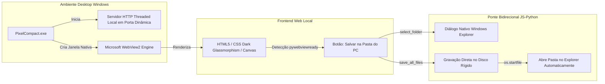

# Software Design Document (SDD.md)
## Conversor de Imagens para JPG Compacto Web

---

## 1. Visão Geral e Objetivos Arquiteturais

### 1.1. Propósito do Sistema
O **Conversor de Imagens para JPG Compacto Web** é um sistema web 100% *client-side* (executado exclusivamente no navegador do usuário) projetado para converter imagens de diversos formatos (`PNG`, `HEIC/HEIF`, `BMP`, `WEBP`, `TIFF`, etc.) para o formato `JPG/JPEG` ultra-compacto, otimizado para transmissão e consumo na internet.

### 1.2. Princípios Arquiteturais Fundamentais
1. **Privacidade Absoluta (Zero-Knowledge):** Nenhum byte de imagem trafega por redes externas ou servidores de terceiros.
2. **Alta Performance com Gestão de Memória:** O navegador é um ambiente restrito em RAM. O sistema deve tratar imagens em lote sem causar travamentos na thread principal de renderização (*Main Thread*) nem exceder limites de alocação de memória (*OOM - Out of Memory*).
3. **Resiliência a Formatos Heterogêneos:** Capacidade de decodificar formatos modernos da Apple (HEIC) e legados do Windows (BMP) de maneira uniforme e transparente para o usuário.
4. **Otimização Especializada para Web:** Produção de JPGs que minimizem o peso em kilobytes através de controle de qualidade, remoção de metadados supérfluos (EXIF, GPS) e achatamento de transparência.

---

## 2. Diagrama de Arquitetura e Fluxo de Dados

```mermaid
flowchart TD
    subgraph UI_Layer [Camada de Apresentação e Interação - UI/UX]
        DZ[Dropzone & File Input] -->|Arquivos Selecionados| VM[Módulo de Validação e Filtro]
        CTRL[Painel de Controles: Qualidade, Redimensionamento] -->|Configurações| QM[Fila de Conversão - Queue Manager]
        ST[Painel de Status e Badges de Economia] <--|Progresso e Resultados| QM
        DL[Botões de Download: Individual e ZIP] <--|Blobs Otimizados| QM
    end

    subgraph Validation_Layer [Camada de Validação de Escopo]
        VM -->|MIME / Extensão Permitida| QM
        VM -->|Vídeo, GIF ou Extensão Falsa| ERR[Rejeição com Alerta Visual]
    end

    subgraph Processing_Layer [Camada do Motor Gráfico - Client-Side Engine]
        QM -->|Concorrência Limitada: Max 2| WRK[Dispatcher de Conversão]
        
        WRK -->|Se HEIC/HEIF| DEC_HEIC[Decodificador HEIC via heic2any / Wasm]
        WRK -->|Se PNG/BMP/WEBP/JPG| DEC_NAT[Decodificador Nativo: createImageBitmap / Image]
        
        DEC_HEIC -->|ImageData / Canvas| BLIT[Normalização Gráfica em Canvas 2D]
        DEC_NAT -->|ImageBitmap / Canvas| BLIT
        
        BLIT -->|Fundo Branco para Transparência Alfa| RESIZE[Redimensionamento Proporcional Opcional]
        RESIZE -->|Canvas Final| ENC[Encoder JPEG Nativo: canvas.toBlob]
        ENC -->|Remoção de Metadados & Ajuste de Qualidade| BLOB[Novo Blob JPG Otimizado]
    end

    subgraph Export_Layer [Camada de Armazenamento e Exportação Local]
        BLOB -->|Criação de URL Temporária| MEM[URL.createObjectURL]
        BLOB -->|Injeção no Pacote| ZIP[Agrupador JSZip para Lote]
        MEM --> DL
        ZIP --> DL
    end
```

---

## 3. Especificação do Pipeline de Processamento de Imagens

### 3.1. Fase 1: Ingestão e Validação Rigorosa
Quando o usuário solta ou seleciona arquivos, cada item passa pela função de triagem:
- **Verificação de Tipo MIME & Extensão:**
  - Permitidos: `image/png`, `image/heic`, `image/heif`, `image/bmp`, `image/x-ms-bmp`, `image/webp`, `image/tiff`, `image/jpeg`.
  - Rejeitados com Erro Imediato:
    - `video/*` (`.mp4`, `.mov`, `.avi`, `.mkv`, etc.).
    - `image/gif` (bloqueado para evitar perda da animação ou geração de quadros estáticos indesejados).
    - Extensões inexistentes ou formatos de documentos (`.pdf`, `.exe`, etc.).

### 3.2. Fase 2: Decodificação Específica por Formato
1. **Imagens Nativas (`PNG`, `BMP`, `WEBP`, `JPEG`):**
   - Utilização primária de `createImageBitmap(file)` devido à sua execução assíncrona fora da thread de renderização, resultando em menor sobrecarga na UI.
   - Fallback para `new Image()` via `FileReader` para navegadores legados ou variantes específicas de BMP.
2. **Imagens Apple (`HEIC` / `HEIF`):**
   - Arquivos `.heic` não são suportados nativamente pelos decodificadores padrão de vários navegadores desktop (como Chrome no Windows).
   - O pipeline direciona o Blob para a biblioteca `heic2any` (que opera sobre uma compilação Wasm de `libheif`).
   - O arquivo HEIC é convertido em um Blob intermediário de alta qualidade e então transferido para o contexto do Canvas.

### 3.3. Fase 3: Tratamento de Canal Alfa e Normalização Gráfica
Arquivos `PNG` e `WEBP` frequentemente possuem áreas transparentes (canal Alpha). Como o formato `JPG` não suporta transparência, a conversão direta não tratada pode gerar um fundo preto opaco.
- **Solução Implementada:**
  1. Cria-se um `OffscreenCanvas` ou `HTMLCanvasElement` com as dimensões finais da imagem.
  2. O contexto 2D é preenchido inteiramente com uma cor de fundo neutra branca pura (`ctx.fillStyle = '#FFFFFF'; ctx.fillRect(0, 0, width, height);`).
  3. A imagem decodificada é desenhada (*blitted*) sobre este fundo branco (`ctx.drawImage(...)`), garantindo uma transição suave e estética das transparências.

### 3.4. Fase 4: Redimensionamento Proporcional (Downscaling Inteligente)
Se o usuário selecionar um limite de resolução para a web (ex: `Full HD 1080p` ou `HD 720p`):
- O sistema calcula a proporção de aspecto (*Aspect Ratio*):
  $$\text{fator} = \min\left(1, \frac{\text{maxDimensao}}{\max(\text{larguraOriginal}, \text{alturaOriginal})}\right)$$
- A interpolação de alta qualidade é ativada no Canvas (`ctx.imageSmoothingEnabled = true; ctx.imageSmoothingQuality = 'high'`).

### 3.5. Fase 5: Compressão JPEG e Eliminação de Metadados
- A imagem é codificada através da API:
  ```javascript
  canvas.toBlob(callback, 'image/jpeg', qualityLevel);
  ```
- **Remoção de Metadados:** Ao repintar os pixels crus no Canvas e exportar novamente, todos os dados residuais pesados (tags EXIF extensas, coordenadas de GPS de câmeras, miniaturas embutidas e perfis de cores ICC desnecessários) são descartados por definição, poupando dezenas de kilobytes por imagem.
- **Níveis de Qualidade Web:**
  - *Máxima Economia:* `quality = 0.68` (ideal para blogs, catálogos e sites de alta velocidade).
  - *Equilibrado (Recomendado):* `quality = 0.82` (equilíbrio perfeito entre ausência de artefatos visuais e redução drástica de peso).
  - *Alta Fidelidade:* `quality = 0.92` (para fotografias onde detalhes finos precisam ser preservados).

---

## 4. Gestão de Memória e Concorrência

Processar múltiplas imagens de 24MP ou 48MP simultaneamente no navegador pode consumir rapidamente centenas de megabytes de RAM. Para assegurar estabilidade contínua:

### 4.1. Fila de Concorrência Controlada (*Concurrency Limit*)
O sistema utiliza um *Queue Manager* com um semáforo de concorrência estrita:
- **Limite Máximo de Concorrência:** 2 imagens processadas em paralelo.
- **Comportamento:** Se o usuário arrastar 15 arquivos, 2 começam imediatamente; assim que um é finalizado e seu Blob é gerado, o próximo é despachado, mantendo a memória sob controle.

### 4.2. Ciclo de Vida de Recursos e Limpeza
- **Descarte de Canvas:** Após a geração do Blob de saída, as dimensões do Canvas são zeradas (`canvas.width = 0; canvas.height = 0`) para incentivar a desalocação de buffers gráficos pela GPU/VRAM do navegador.
- **Revogação de Object URLs:** URLs temporárias geradas para pré-visualização (`blob:http...`) são monitoradas e descartadas através de `URL.revokeObjectURL()` quando a imagem é removida da lista ou a conversão é concluída.

---

## 5. Estruturas de Dados Principais

```typescript
// Interface representativa das configurações de conversão
interface ConversionSettings {
  quality: number;               // 0.6 a 0.95
  maxWidth?: number;             // ex: 1920, 1280 ou null para tamanho original
  backgroundColor: string;       // Padrão '#FFFFFF' para canal alfa
}

// Interface de um item na fila de processamento
interface QueueItem {
  id: string;                    // UUID ou timestamp único
  file: File;                    // Objeto de arquivo original
  originalName: string;
  originalSize: number;
  originalFormat: string;        // 'PNG' | 'HEIC' | 'BMP' | 'WEBP' | 'TIFF' | 'JPG'
  status: 'pending' | 'processing' | 'completed' | 'error';
  progress: number;              // 0 a 100%
  errorMessage?: string;
  outputBlob?: Blob;
  outputSize?: number;
  reductionPercentage?: number;  // Calculado: ((originalSize - outputSize) / originalSize) * 100
  downloadUrl?: string;
}
```

---

## 6. Exportação e Empacotamento em Lote (JSZip)

1. **Download Individual:** Cada cartão de imagem na lista possui seu botão de download direto apontando para o Blob com o atributo `download="nome-original.jpg"`.
2. **Download em Lote (ZIP):**
   - A biblioteca `JSZip` cria um novo contêiner `.zip` na memória.
   - Cada arquivo convertido com status `completed` é adicionado ao arquivo ZIP (`zip.file(cleanName + '.jpg', item.outputBlob)`).
   - O arquivo resultante é compactado usando o método `DEFLATE` e disponibilizado para download com o nome `imagens-otimizadas-jpg.zip`.

---

## 7. Matriz de Tratamento de Erros e Exceções

| Cenário de Erro | Causa Provável | Ação do Sistema | Feedback ao Usuário |
| :--- | :--- | :--- | :--- |
| **Arquivo de Vídeo (.mp4, etc.)** | Usuário arrastou arquivo fora do escopo | O arquivo é rejeitado antes de entrar na fila de decodificação | Toast vermelho: *"Vídeos não são suportados. Envie apenas imagens estáticas."* |
| **Arquivo GIF (.gif)** | GIF animado fora do escopo | Rejeição imediata na validação MIME | Toast informativo: *"Conversão de GIFs não suportada no escopo deste conversor."* |
| **HEIC Não Decodificável** | Arquivo corrompido ou formato proprietário desconhecido | O bloco `try...catch` de `heic2any` captura a exceção | Item sinalizado com badge de erro: *"Não foi possível decodificar este arquivo HEIC."* |
| **Imagem com Dimensão Gigante (>10.000px)** | Esgotamento de limites de Canvas do browser | Detecção precoce de resolução no `ImageBitmap` | Mensagem de erro avisando sobre limite de resolução excedido |
| **Extensão Falsa (.jpg contendo binário de .exe)** | Tentativa de forjar tipo de arquivo | Erro durante a decodificação da imagem no Canvas | Erro amigável: *"Arquivo corrompido ou não reconhecido como imagem válida."* |

---

## 8. Segurança e Sandboxing

- **Zero Chamadas de Rede:** A aplicação não necessita de nenhuma conexão com a internet após o carregamento inicial dos assets.
- **Proteção contra Cross-Site Scripting (XSS):** Nomes de arquivos inseridos pelo usuário no DOM são escapados como texto puro (`textContent`), impedindo injeção de tags HTML maliciosas através de metadados de arquivos.
- **Sanitização de Path Traversal no ZIP:** Caracteres como `../` ou separadores de caminho absolutos são removidos dos nomes dos arquivos antes da adição ao `JSZip`.

---

## 9. Arquitetura Desktop Nativa (Microsoft WebView2 + PyWebView)

Para uso como software nativo de computador pessoal (`.exe`), o sistema incorpora uma camada de integração com o sistema operacional:



### 9.1. Componentes do Executável Desktop
1. **`desktop_app.py`:** Ponto de entrada desktop. Inicializa um servidor HTTP local em uma thread daemon com porta dinâmica e monta a janela `webview.create_window` com ícone personalizado `icon.ico`.
2. **`DesktopAPI`:** Interface Python acessível pelo JavaScript com métodos seguros:
   - `select_folder()`: Invoca o `create_file_dialog(FOLDER_DIALOG)` nativo do Windows.
   - `save_all_files(files_payload, target_dir)`: Decodifica os bytes Base64 dos JPGs otimizados e grava os arquivos diretamente na pasta selecionada, abrindo-a no Windows Explorer após a conclusão.
3. **`build_exe.py`:** Automação com PyInstaller com parâmetros `--noconsole` e `--onefile`, gerando o executável standalone de ~13 MB em `dist/PixelCompact.exe`.
